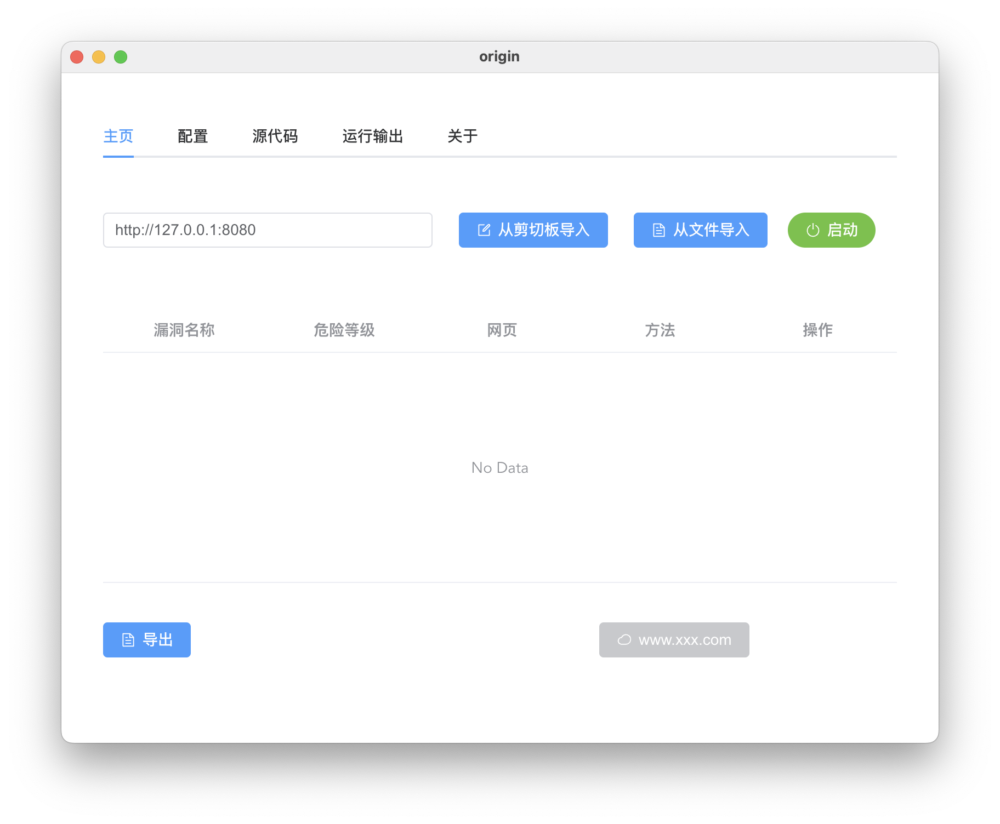
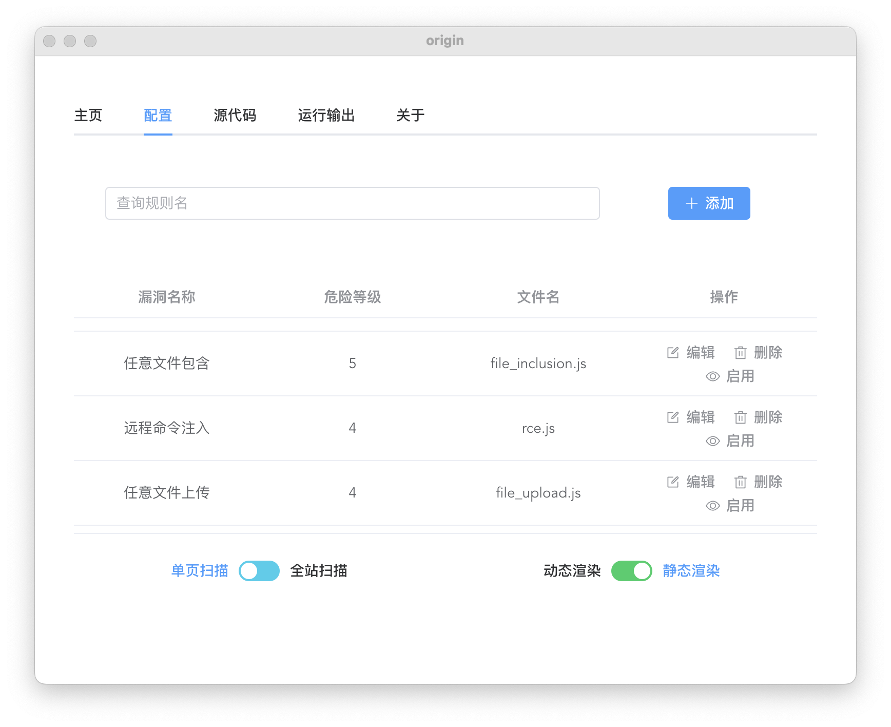
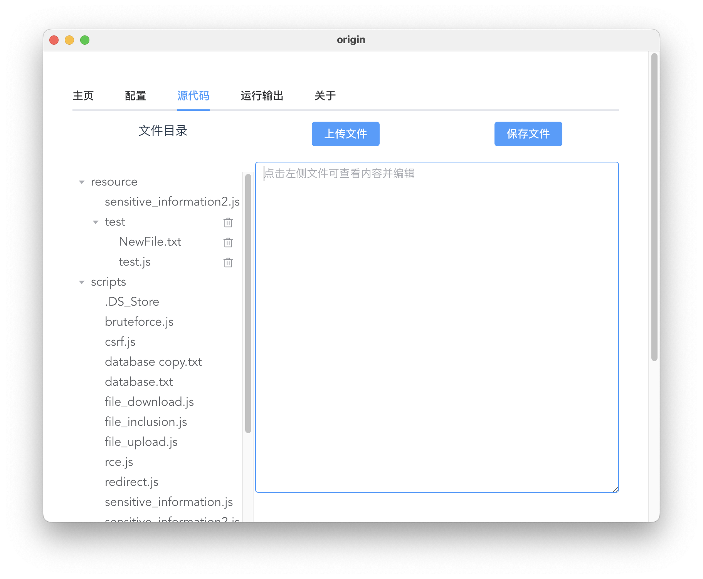
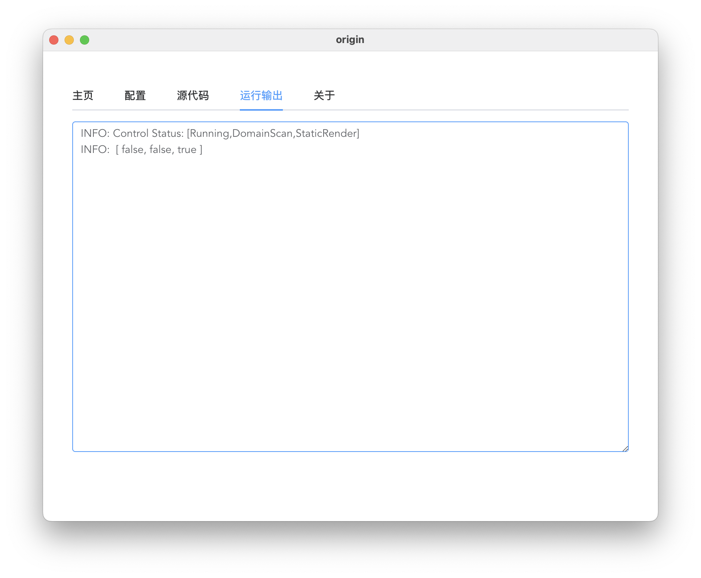
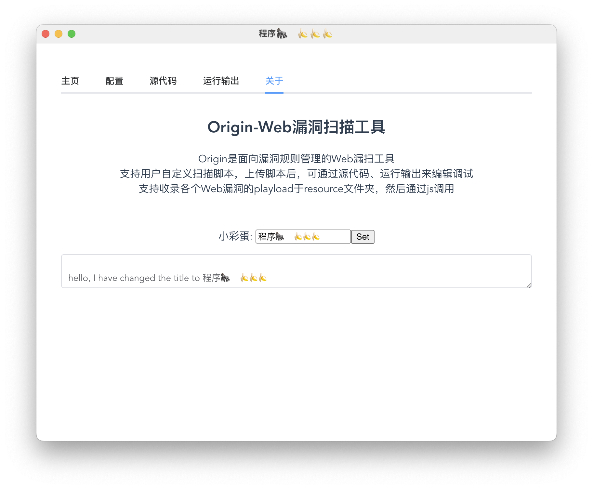

## Web Origin 漏扫

### 介绍

这是一个面向漏洞规则管理的Web漏洞扫描工具。目前还是实验阶段，只是搭建了一个平台，我按照我对各个Web漏洞原理的理解，写了10个通用漏洞扫描的脚本， 并在[皮卡丘靶机](https://github.com/zhuifengshaonianhanlu/pikachu)上做了测试。

支持的漏洞如下

- [x] XSS 跨站脚本注入
- [x] CSRF 跨站伪造请求
- [x] SSRF 服务端请求伪造
- [x] 暴力破解 
- [x] 任意文件包含
- [x] 任意文件上传
- [x] 任意文件下载
- [x] 远程命令注入
- [x] URL重定向
- [ ] SQL注入    （封装的sqlmap api，需要用户自己配置一下）
- [x] 敏感信息泄漏

但很多脚本的playload还不够完善，估计只能应付些简单的场景。

除了通用漏洞，很多的组件的漏洞也没有收集起来，这个得依赖平时的积累了，没错，安全很吃经验。

> 其实还有很多可以优化的点，比如爬虫，采用模拟点击+拦截的方法来获得发送的请求，，，之前在某大厂的安全部门实习做了Web漏洞扫描的优化，发现我自己写的工具还是有很多可以改进的点的哈哈


### 本地编译
```sh
Nodejs v22.13.1
vue3
Chrome本地浏览器（默认安装路径即可）
```
用electron+vue写的,直接运行的方式如下

```sh
npm install
npm run vbuild
npm run estart
```

然后通过如下方式生成本地机器环境的安装包，该安装包位于out目录下

```sh
npx electron-forge import
npm run make
```


### 界面展示


#### 主页面

- 扫描网站的URL设置
- 剪切板/文件导入原始的请求 （可带cookie）
- 导出扫描结果
- 启动/停止扫描



#### 配置页面

- 漏洞规则的增删改查

- 启动/禁用某个漏洞规则

- 单页/全站扫描   即爬虫是否要递归爬取网页

- 动态/静态渲染   即爬虫爬取网页的过程中是否启用浏览器渲染页面

  



#### 源代码界面

- 实时编辑源代码并保存
- resource 文件夹可上传其他大佬的程序以便封装调用，它和scripts在同一级目录



#### 运行输出界面

- 单纯的为了方便调试自己上传的漏洞扫描脚本




#### 关于页面

- 最初始的页面，第一次接触electron的时候，写了一个测试的页面，熟悉了一下其前后端的交互逻辑，现在是作为简要的介绍


